## <a name="top"></a> Trivio Quizlet App

**Trivio Quizlet** is a full-stack web application allowing users to take quizzes and create and manage their quizzes.

## Contents
* [Project Description](#description)
* [Tech Stack](#technologies)
* [Features](#features)
* [How to Run](#running)
* [Development Process](#development)
* [Challenges](#challenges)
* [Retrospective](#retrospective)
* [About the Team](#team)

## <a name="description"></a> Project Description

Trivio is an easy to use online Quiz taking application. With online school becoming the norm, we wanted to create a way 
to make quiz taking easier for both the quiz creator and quiz taker in one online platform! Anyone can use this software 
to take previously created quizzes and/or create new quizzes for others to interact with. When navigating to our home 
page you will have the option to navigate to either the "Take Quiz" or "Quiz Management" page depending on your intent.

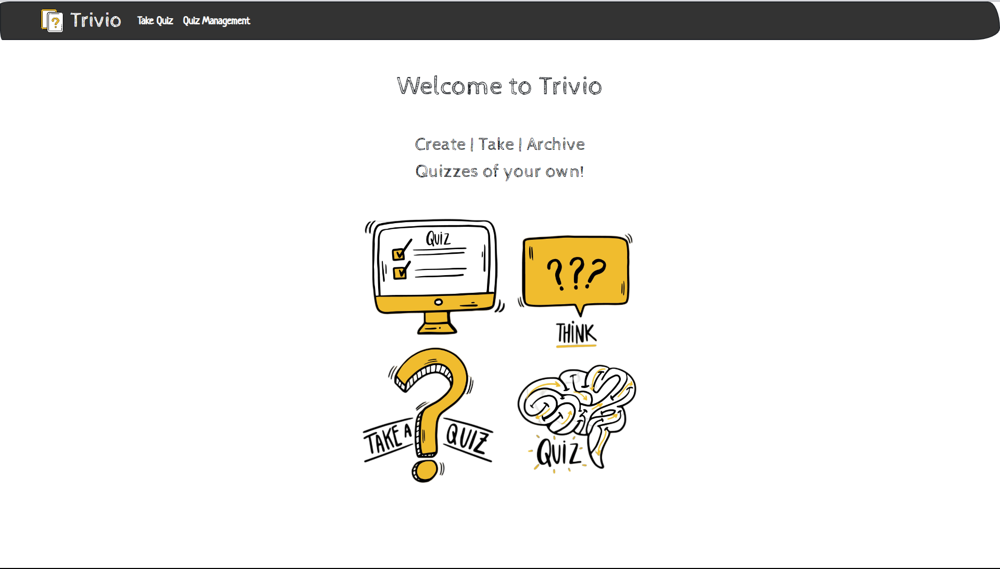

As you can tell, our webpage is simple, clean, and easy to read, while edging on the side of nostalgia. Think back to the 
days of chalkboards and rulers, a sunny day where you can feel the chalk dust tickling your nose while your teacher hands 
out today's pop quiz. It was a much simpler time that allowed us to focus on things that were most important: like learning! 
Trivio aims to remove the noise and distraction and be the tool needed to help our friends be the best they can be in 
their learning journey. 

***For Quiz Takers:***

Navigate to our "Take Quiz" page. 

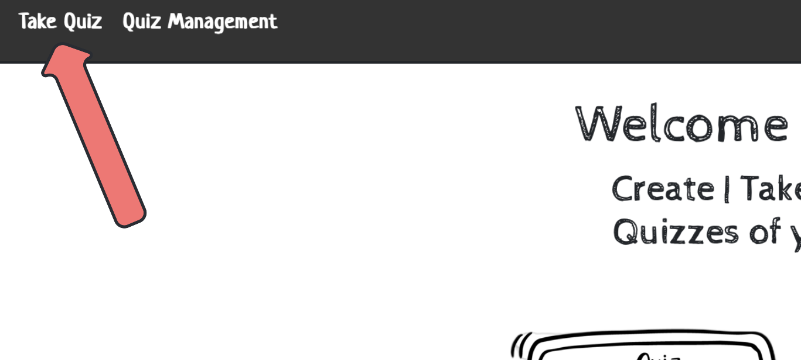

Here you will see a list of all the active quizzes we currently host in our database! Take as many quizzes as you'd like! 
Our server is made for YOU! Each question will test your knowledge and give you immediate feedback on how you are performing. 

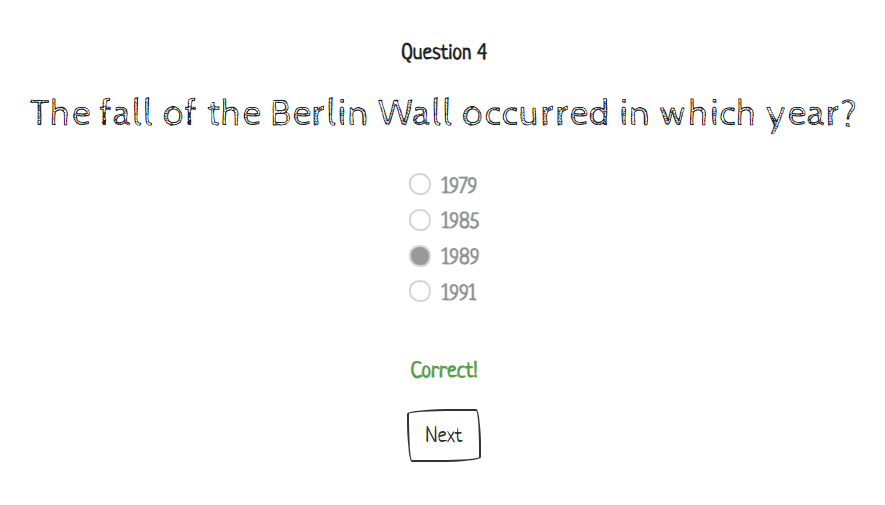

And will end with you seeing your total score and percentage!

***For Quiz Creators:***

Navigate to our "Quiz Management" Page:

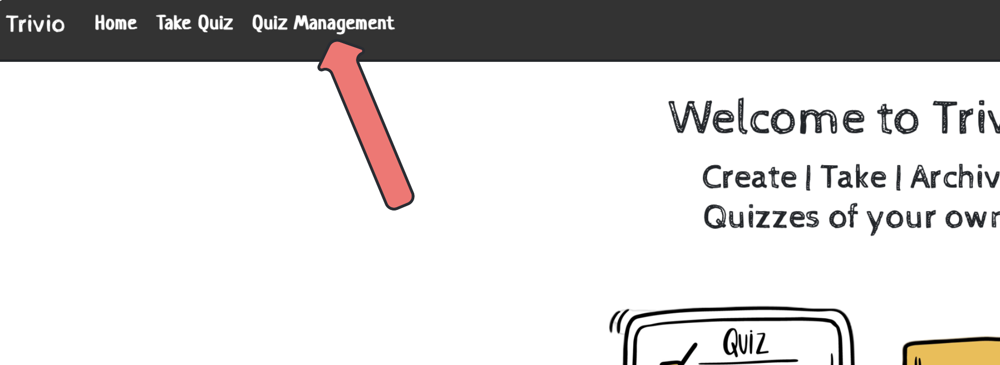

Here you will have access to all of the quizzes in our database, including inactive quizzes. You can create your own
quizzes, edit existing ones, and change the "Active Status" of tests as needed!

<p align="right"><a href="#top">back to top</a></p>

## <a name="technologies"></a>Tech Stack
- **Backend**
  - Java
  - Spring Boot
  - MySQL
- **Frontend**
  - Thymeleaf 
  - JavaScript
  - Bootstrap
  - HTML5
  - CSS3
 
 <p align="right"><a href="#top">back to top</a></p>

## <a name="features"></a> Features

On the `Take Quiz` page a user can see a list of all active quizzes available and choose a quiz to take by clicking the `Take Quiz` button  

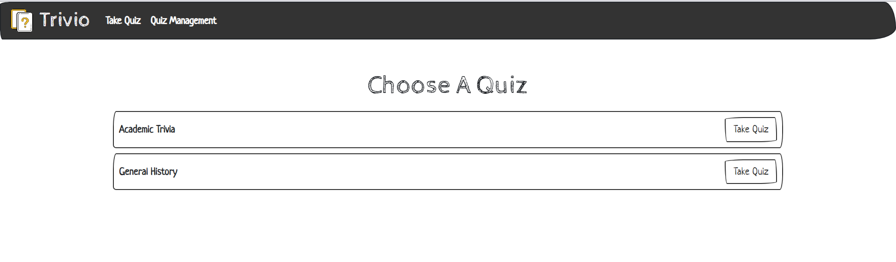

The quiz page initially displays the name of the quiz and the total number questions.  
It also displays the `Take quiz` button that allows a user to begin the quiz

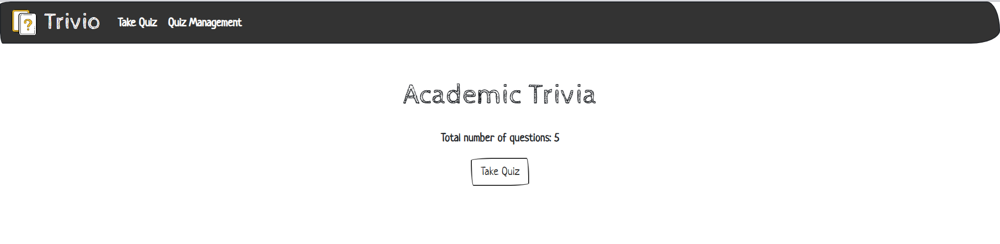

After clicking the `Take Quiz` button, users can see one question at a time.  
They can submit their answer by clicking the `Submit` button and immediately receive feedback on whether their choice was correct or incorrect

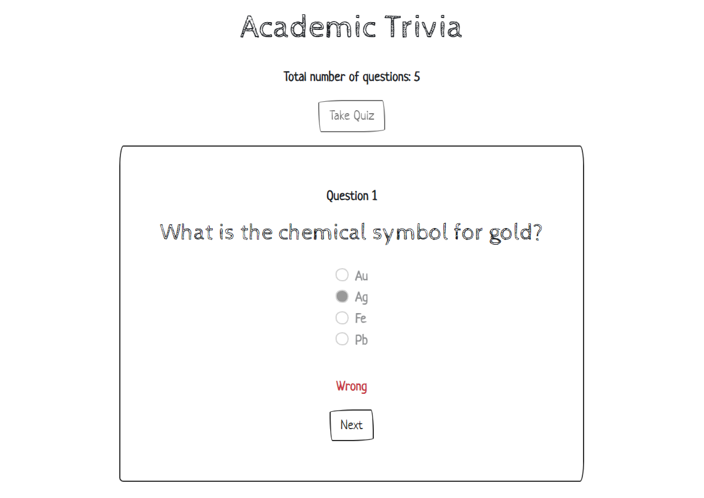

After submitting the last question, the `Next` button disappears, and a message indicating that the quiz is complete appears along with a `Show Results` button  

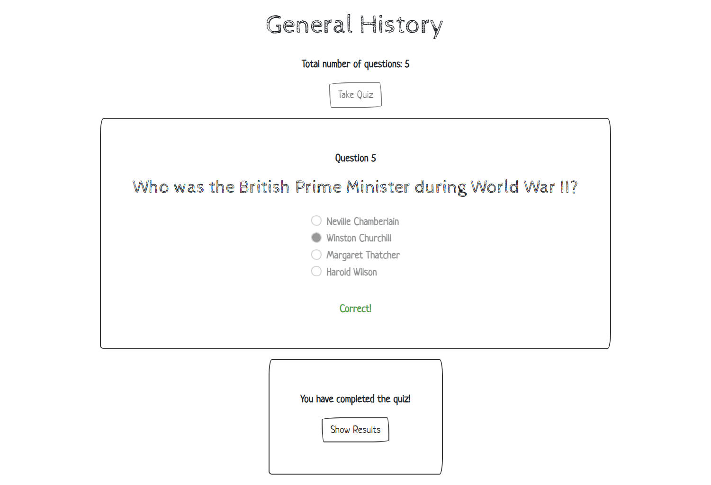

<p align="right"><a href="#top">back to top</a></p>

## <a name="running"></a> How to Run
To run the Trivio Quizlet App:

1. Install MySQL, Java and Maven

2. Clone or fork this repo:

```
https://github.com/full-stack-devs-learn/niantic-2024-sprint-2-team-7.git
```

3. Run the `trivio-db.sql` database script located in the `database` folder to create the Trivio database

4. Run `TrivioApplication` 

5. You can now navigate to `localhost:8080/` to access the Trivio Quizlet App.
 
<p align="right"><a href="#top">back to top</a></p>


## <a name="development"></a> Development Process

Throughout our process, we used a Trello board to track our progress and keep us on task in order of importance of completion. 
Once we knew what we wanted our website to look like we started coding, starting with the most important aspect first: accessing 
the database quizzes and allowing users to take them! 

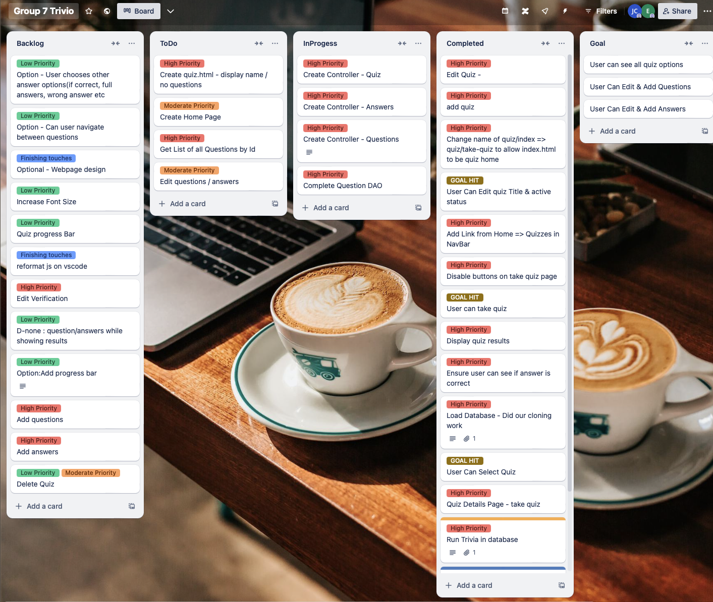

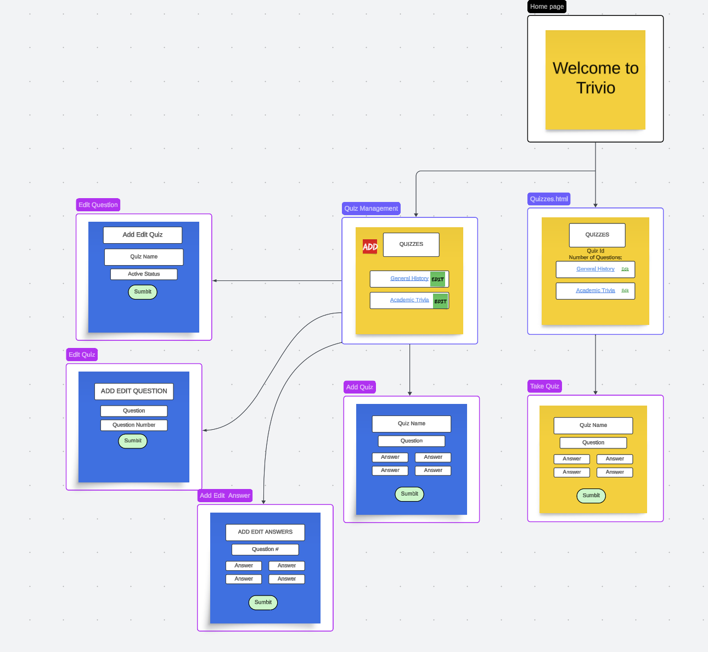

We created a table chart to help visualize our database tables and their corresponding keys for clear understanding while creating 
our SQL queries to gather the correct data when necessary
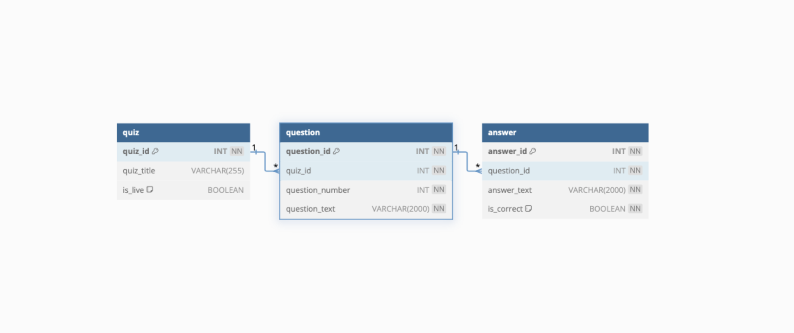
 
<p align="right"><a href="#top">back to top</a></p>


## <a name="challenges"></a> Challenges
We had a few bugs that popped up throughout this project:  

1. Server-side validation was problematic. We were unable to receive appropriate errors when fields were left empty in our edit/add forms. We tried 
the use of both `@NotEmpty` and `@NotBlank`, but neither seemed to change the issue. 
We ended up realizing that we were using the wrong order of parameters within our controllers.
Originally we wrote
```
@PostMapping("/questions/{quizId}/add")
    public String addQuestion(Model model,
                              @Valid @ModelAttribute("question") Question question,
                              @PathVariable int quizId,
                              BindingResult result) 
```

and realized that we needed to have BindingResult following directly after the @Valid parameter in order for it to properly validate

```

@PostMapping("/questions/{quizId}/add")
    public String addQuestion(Model model,
                              @Valid @ModelAttribute("question") Question question,
                              BindingResult result,
                              @PathVariable int quizId)
```

2. During the development portion of the `take-quiz.html` we found issues accessing all the answers pertaining to the current question. We originally tried using fragments and multiple fetch statements in our JavaScript, but after a few glitches and improper fetching, we decided to pivot away from using a fragment and instead utilized an API rest controller to @GetMap all of the information at once. This greatly decreased the clutter in our code and cleared up the performance issues we were having.

3. Another challenge we encountered was related to Thymeleaf form binding for data submission. Our edit quiz form had only two fields: `quizTitle` and `isLive`. While data binding for the `quizTitle` text field worked as expected, we faced difficulties setting the boolean `isLive` attribute to true. We were using the following form binding:
```
<form id="edit-quiz" method="post" th:object="${quiz}" ...

    <input class="form-check-input" type="checkbox" id="isLive" name="isLive" th:field="*{isLive}">

</form>
```
After some debugging and research, we discovered that Thymeleaf was not functioning correctly with the setter and getter methods we had defined for the boolean attribute in our `Quiz` class.

Initially, we had a getter named `isLive` and a setter named `setLive`. By renaming the getter to `getIsLive` and the setter to `setIsLive`, we were finally able to successfully set the boolean attribute of the Quiz object.

Later, we learned from another team (Team 2) that there was an alternative solution to this problem: instead of using `*{isLive}`, we could have used `*{live}`. This approach would have eliminated the need to rename the setter and getter methods.

<p align="right"><a href="#top">back to top</a></p>

## <a name="retrospective"></a> Retrospective


#### Elena's Favorite Code Block:
```
    @GetMapping("/api/quizzes/{quizId}/question/{questionNumber}")
    public Question getQuestionByQuestionNumber(@PathVariable int quizId, @PathVariable int questionNumber) {
        Question question = questionDao.getQuestion(quizId, questionNumber);
        ArrayList<Answer> answers = answerDao.getAnswersByQuestionId(question.getQuestionId());
        question.setAnswers(answers);
        return question;
    }
```

#### Jessy's Favorite Code Block:
I have a tie between this code block 
```
    @GetMapping("/api/quizzes/{quizId}/question/{questionNumber}")
    public Question getQuestionByQuestionNumber(@PathVariable int quizId, @PathVariable int questionNumber) {
        Question question = questionDao.getQuestion(quizId, questionNumber);
        ArrayList<Answer> answers = answerDao.getAnswersByQuestionId(question.getQuestionId());
        question.setAnswers(answers);
        return question;
    }
```
 and this code block:
```
 <div class=" card d-flex flex-column gap-3 text-nowrap">
            <table id="delete-answer" class="table mb-1">
                <tr>
                    <th>Question</th>
                    <td class="text-center text-nowrap" th:text="${question.questionText}"></td>
                </tr>

                <tr>
                    <th>Answer text:</th>
                    <td th:text="${answer.answerText}"></td>
                </tr>

                <tr>
                    <th>Correct Answer?</th>
                    <td th:text="${answer.isCorrect ? 'Correct' : 'Incorrect'}"></td>
                </tr>
            </table>

```


#### Elena:
I had a great time working on this project. First of all, I really liked the idea of pair programming. Working together in pairs was incredibly rewarding. We enjoyed sharing our knowledge and supporting each other throughout the project. Another thing I want to mention is our development process planning. We were able to stay focused and organized by planning our tasks and working collaboratively. As a result, we were able to complete most of the core functionalities. It was also very satisfying to see how all the concepts we learned could be combined to create a functional full-stack web application.  

Lessons I learned:  
- While pair programming can be slower initially, it fosters better understanding and code quality.
- Switching roles regularly keeps both partners engaged and learning.
- Trello proved valuable for tracking tasks and visualizing progress.
- Breaking down requirements into smaller, achievable units is crucial for successful project completion.
  
With more time, I would implement:
- more quiz options to take the quiz, like allowing users to navigate questions, show/not show correct answers, show timer, etc
- organize quizzes into topics/categories (=add one more table, Categories, to our database schema)
- add images for both questions and answers (=add one more column for image URL to tables Question and Answer)
- allow users to create accounts, log in, and log out, and store user scores for each quiz (=add two more tables, User and Score)


#### Jessy:
I learned a lot from this project and enjoyed it from beginning to end. Working with a different partner in the project allowed me to see how other programmers behave with their coding skills compared to myself and how my other partner compelte tasks.  I was able to become a lot more comfortable with working with each component and gaining a better understanding of what role each component plays in the overall scheme of our project. I learned a bit more about JavaScript and it's flexibility and how that can both positively and negatively impact the coding experience. My partner was very helpful in filling in the gaps where I didn't feel as confiden and I hope that I was able to do the same for her. Being able to talk through some issues and potential fixes was very helpful to me in verifying my own understanding and seeing another's way of fixing an issue that I may not have thought of.
I was very happy with how we decided to breakdown the prject goals into smaller and more manageable bits. This allowed us to focus on one task at a time rather than be overwhelmed and unsure on where to begin. I really enjoyed working with my partner and the tools that we used to organize ourselves. 

 If I had the chance to do this project over, I would change the way I coded slightly, I think slowing down and paying closer attention to how variables are being called and how Thymeleaf interacts/ what type of tags it requires to work. I would also spend less time with certain bugs and pivot sooner, we had a lot of wasted time on small fixes (although we did learn a lot from each of those experiences as well so maybe not?).  
 There were so many features we thought of adding if we had more time:
- quiz categories so we could organize the quizzes into specific categories. 
- adding a bit more beautification properties in the way of a little mroe color/ images.
- I'd like to add a button to the take quizzes to allow users to return to a previously answered question or potentially a read out of all their reponses that is showed in the Show Results page (that would require saving results: a current limitation on this project)
- I would add a login page for both quiz takers and quiz users, ensuring that quizzes aren't corupted with wrong information. Users could then track their progress and have guides on what they need to continue study based on what they missed. This would also allow users to rank themselves amongst other quiz takers, tract their progress overall and earn badges to help encourage continuing use.
- I'd love to see images within the questions themselves. My partner thought of this and I thought it would be a great feature for users.

<p align="right"><a href="#top">back to top</a></p>
  
## <a name="team"></a>About the Team

Trivio Quizlet App was created by [Jessy](https://github.com/Jessyc379) and [Elena](https://github.com/ElenaByc) as a four-day pair-programming project. 

Thank you for your interest in our project!  
We would love to connect and hear your feedback!  

Jessy Cesena [linkedin.com/in/jessycesena](https://linkedin.com/in/jessycesena)  
Elena Bychenkova [linkedin.com/in/elena-bychenkova](https://linkedin.com/in/elena-bychenkova)

 <p align="right"><a href="#top">back to top</a></p>
