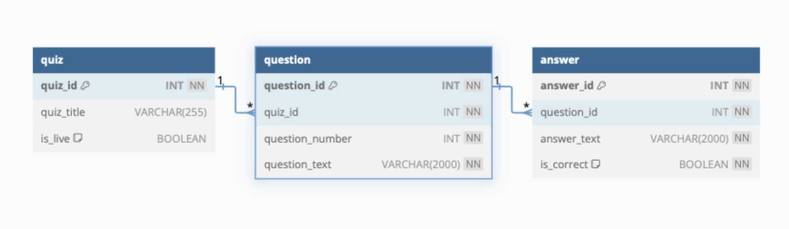

# Trivio Quizlet App

[------------Describe Your Project:------------]:#

Trivio is a easy to use online Quiz taking application. With online school becoming the norm, we wanted to create a way 
to make quiz taking easier for both the quiz creater and quiz taker in one online platform! Anyone can use this software 
to take previously created quizzes and/or create new quizzes for others to interact with. When navigating to our home 
page you will have the option to navigate to either the "Take Quiz" or "Quiz Management" page depending on your intent.

<center>  </center>

As you can tell, our webpage is simple, clean and easy to read, while edging on the side of nostaglia. Think back to the 
days of chalkboards and rulers, a sunny day where you can feel the chalk dust tickling your nose while your teacher hands 
out today's pop quiz. It was a much simpler time that allowed us to focus on things that were most important: like learning! 
Trivio aims to remove the noise and distraction, and be the tool needed to help our friends be the best they can be in 
their learning journey. 

***For Quiz Takers:***

Navigate to our "Take Quiz" page. 

<center>  </center>

Here you will see a list of all the active quizzes we currently host in our database! Take as many quizzes as you'd like! 
Our server is made for YOU! Each question will test your knowledge and give you immediate feedback on how you are performing. 

<center></center>

And will end with you seeing your total score and percentage!

***For Quiz Creators:***

Navigate to our "Quiz Management" Page:

<center></center>

Here you will have access to all of the quizzes in our database, including inactive quizzes. You are able to create your own
quizzes, edit exisiting ones and change the "Active Status" of tests as needed!

<center></center>

-------------------------------------------------------------------------------------------------------------------------------------------

[------------Describe Your Development Process:------------]:#
**Design Process**


Throughout our process we used a trello board to track our progress and keep us on task in order of importance of completion. 
Once we knew what we wanted our website to look like we started coding, starting with the most important aspect first: accessing 
the database quizzes and allowing users to take them! 

<center>   </center>

We created a table chart to help vizualize our database tables and their corresponding keys for clear understanding while creating 
our SQL queries to gather the correct data when neccessary
<center></center>

-------------------------------------------------------------------------------------------------------------------------------------------

[------------Describe Your Code:------------]:#

We had a few bugs that popped up throughout this project.
1) Server-side validation was problematic. We were unable to recieve appropriate errors for when fields were left empty in our edit/add forms. We tried 
use of both @NotEmpty and @NotBlank, but neither seemed to change the issue. 

**need to fix this bug**

2) We had a small bug in our eventListener function while displaying our questions. It would run smoothly until the quiz came to question three. Upon 
reaching what should have been questions 3, we would be presented with question 4 and the answer options for both question #3 & #4. While reviewing in 
dev tools, I realized that it was pulling up question 3, displaying and then immediately replacing it with the next question. While reviewing our code, 
Elena relized that it could be the way that we wrote our EventListener:
```
nextBtn,addEventListener("click" , () => getQuestion())
```
 and changed it to:
 ```
 nextBtn,addEventListener("click", getQuestion) 
 ```
 and this removed the issue of nested results. 


-------------------------------------------------------------------------------------------------------------------------------------------


[------------Our Favorite Code Blocks:------------]:#

 Elena Code Block:


 Jessy Code Block:


[------------Retrospective:------------]:#
Elena:


Jessy:
