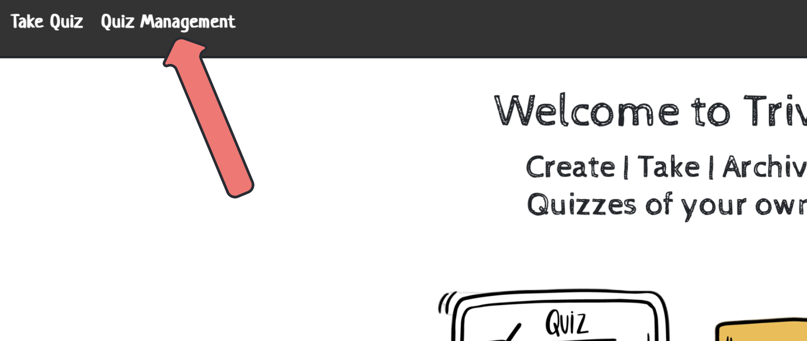

# Trivio Quizlet App

[------------Describe Your Project:------------]:#

Trivio is a easy to use online Quiz taking application. With online school becoming the norm, we wanted to create a way 
to make quiz taking easier for both the quiz creater and quiz taker in one online platform! Anyone can use this software 
to take previously created quizzes and/or create new quizzes for others to interact with. When navigating to our home 
page you will have the option to navigate to either the "Take Quiz" or "Quiz Management" page depending on your intent.

<center>  </center>

As you can tell, our webpage is simple, clean and easy to read, while edging on the side of nostaglia. Think back to the 
days of chalkboards and rulers, a sunny day where you can feel the chalk dust tickling your nose while your teacher hands 
out today's pop quiz. It was a much simpler time that allowed us to focus on things that were most important: like learning! 
Trivio aims to remove the noise and distraction, and be the tool needed to help our friends be the best they can be in 
their learning journey. 

***For Quiz Takers:***

Navigate to our "Take Quiz" page. 

<center>  </center>

Here you will see a list of all the active quizzes we currently host in our database! Take as many quizzes as you'd like! 
Our server is made for YOU! Each question will test your knowledge and give you immediate feedback on how you are performing. 

<center></center>

And will end with you seeing your total score and percentage!

***For Quiz Creators:***

Navigate to our "Quiz Management" Page:

<center></center>

Here you will have access to all of the quizzes in our database, including inactive quizzes. You are able to create your own
quizzes, edit exisiting ones and change the "Active Status" of tests as needed!

<center></center>

-------------------------------------------------------------------------------------------------------------------------------------------

[------------Describe Your Development Process:------------]:#
**Design Process**


Throughout our process we used a trello board to track our progress and keep us on task in order of importance of completion. 
Once we knew what we wanted our website to look like we started coding, starting with the most important aspect first: accessing 
the database quizzes and allowing users to take them! 

<center>   </center>

We created a table chart to help vizualize our database tables and their corresponding keys for clear understanding while creating 
our SQL queries to gather the correct data when neccessary
<center></center>

-------------------------------------------------------------------------------------------------------------------------------------------

[------------Describe Your Code:------------]:#

We had a few bugs that popped up throughout this project.
1) Server-side validation was problematic. We were unable to recieve appropriate errors for when fields were left empty in our edit/add forms. We tried 
use of both @NotEmpty and @NotBlank, but neither seemed to change the issue. 
We ended up realizing that we were using the wrong order of parameters within our controllers
Originally we wrote
```
@PostMapping("/questions/{quizId}/add")
    public String addQuestion(Model model,
                              @Valid @ModelAttribute("question") Question question, @PathVariable int quizId, BindingResult result
                              ) {
```

and realized that we needed to have BindingResult following directly after the @Valid parameter in order for it to properyl validate

```

    @PostMapping("/questions/{quizId}/add")
    public String addQuestion(Model model,
                              @Valid @ModelAttribute("question") Question question, BindingResult result,
                              @PathVariable int quizId)
```


2) We had a small bug in our eventListener function while displaying our questions. It would run smoothly until the quiz came to question three. Upon 
reaching what should have been questions 3, we would be presented with question 4 and the answer options for both question #3 & #4. While reviewing in 
dev tools, I realized that it was pulling up question 3, displaying and then immediately replacing it with the next question. While reviewing our code, 
Elena relized that it could be the way that we wrote our EventListener:
```
nextBtn,addEventListener("click" , () => getQuestion())
```
 and changed it to:
 ```
 nextBtn,addEventListener("click", getQuestion) 
 ```
 and this removed the issue of nested results. 

 3) 


-------------------------------------------------------------------------------------------------------------------------------------------


[------------Our Favorite Code Blocks:------------]:#

 Elena Code Block:


 Jessy Code Block:


[------------Retrospective:------------]:#
Elena:


Jessy:
I learned a lot from this project, I was able to become a lot more comfortable with working with each component and gaining a better understanding 
of what role each component plays in the overall scheme. I learned a bit more about JavaScript and it's flexibility and how that can both positively
and negatively impact the coding experience. My partener was very helpful in filling in the gaps where I didn't feel as confident. Being able to talk through some issues and potential fixes was very helpful to me in verifying my own understanding and seeing another's way of fixing an issue that I may not have thought of. If I had the chance to do this project over, I would change the way I coded slightly, I think slowing down and paying closer attention to how variables are being called and how Thymeleaf interacts/ what type of tags it requires to work. I would also spend less time with certain bugs and pivot sooner, we had a lot of wasted time on small fixes (although we did learn a lot from each of those experiences as well so maybe not?). I really enjoyed working with my partner and the tools that we used to organize ourselves.
 There were so many features we thought of adding if we had more time:
- quiz categories so we could organize the quizzes into specific categories. 
- adding a bit more beautification properties in the way of a little mroe color/ images.
- I'd like to add a button to the take quizzes to allow users to return to a previously answered question or potentially a read out of all their reponses that is showed in the Show Results page (that would require saving results: a current limitation on this project)
- I would add a login page for both quiz takers and quiz users, ensuring that quizzes aren't corupted with wrong information. Users could then track their progress and have guides on what they need to continue study based on what they missed. 
- I'd love to see images within the questions themselves. My partner thought of this and I thought it would be a great featuer for users. 
